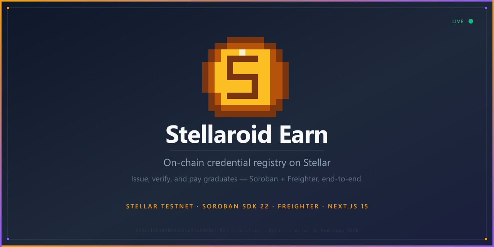
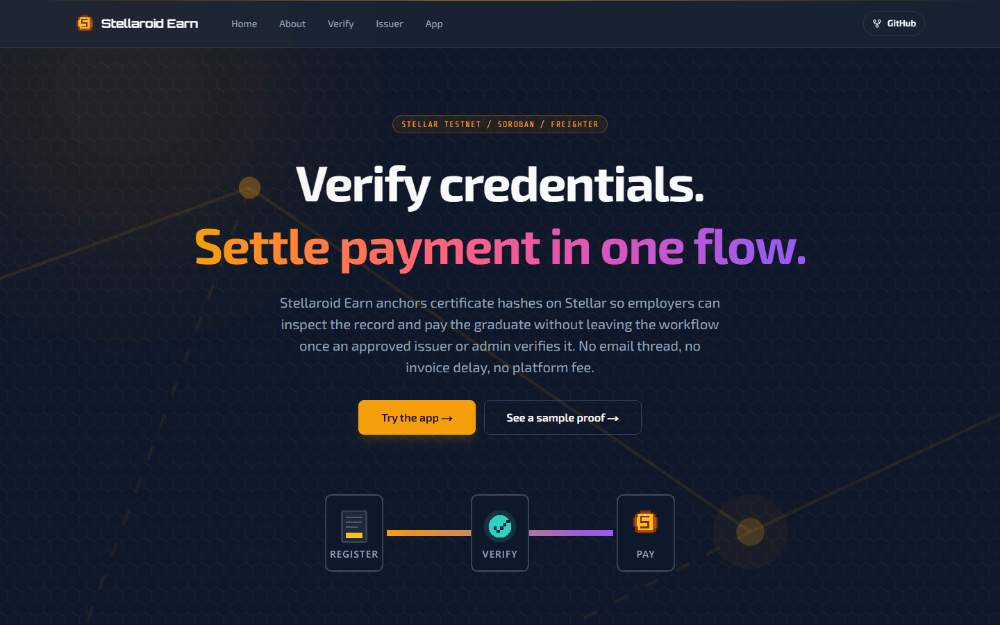
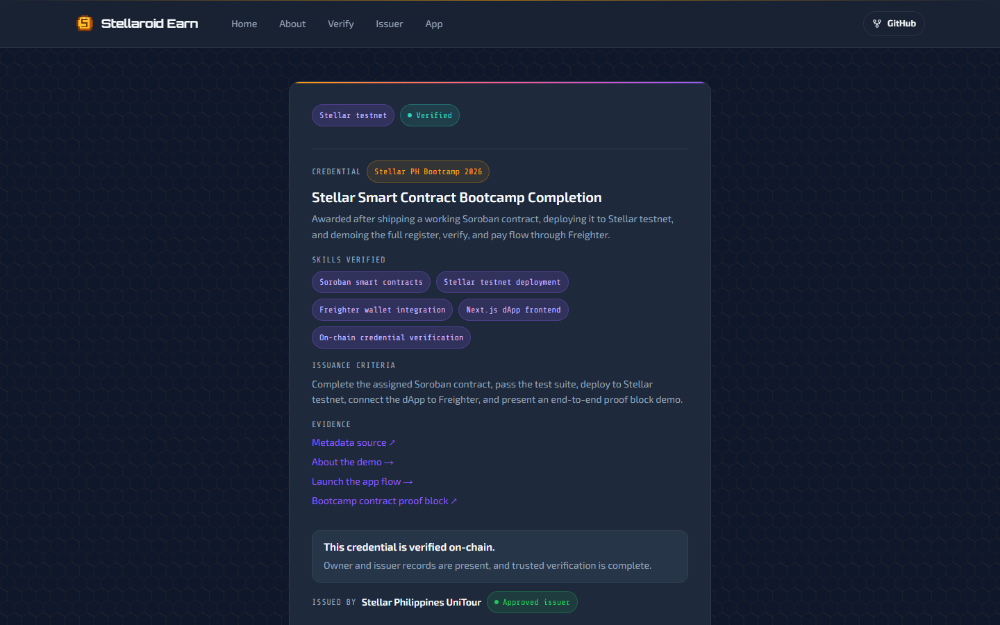
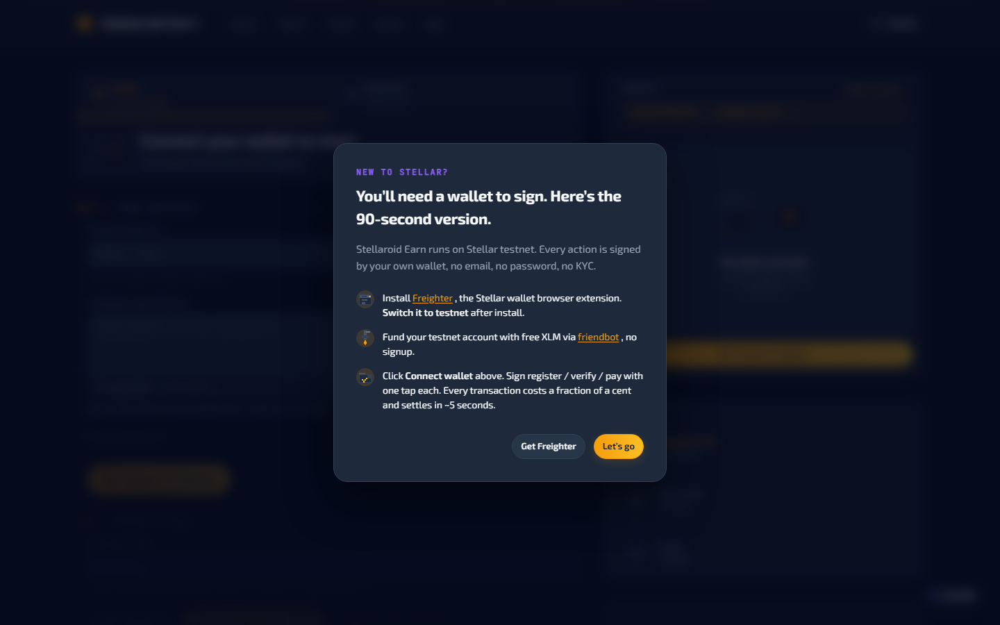
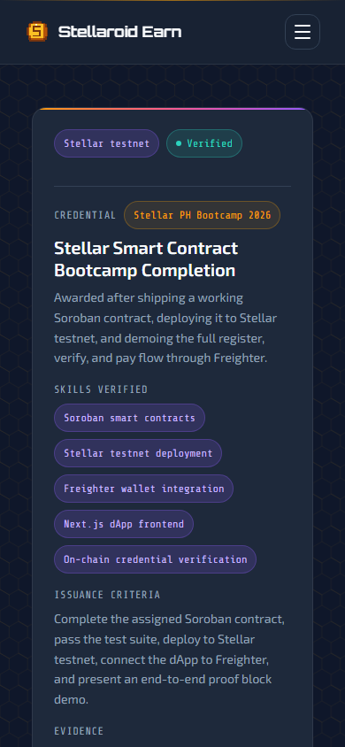
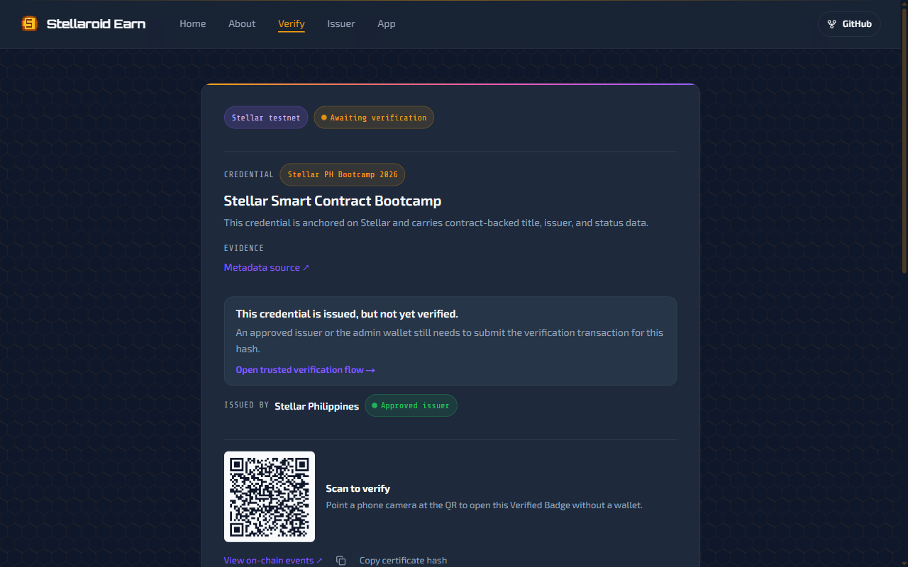
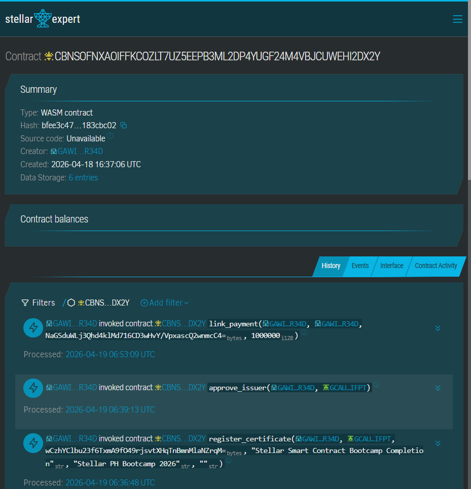
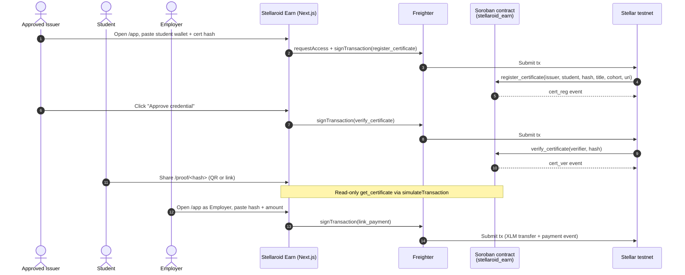

# Stellaroid Earn

**On-chain credential trust for Stellar PH Bootcamp 2026**

Issue, verify, and pay graduates on Stellar testnet — Soroban + Freighter, end-to-end.

[](https://stellaroid-earn-demo.vercel.app/)
[](https://stellar.expert/explorer/testnet/contract/CBNSOFNXAOIFFKCOZLT7UZ5EEPB3ML2DP4YUGF24M4VBJCUWEHI2DX2Y)
[](https://docs.rs/soroban-sdk/22.0.0)
[](https://nextjs.org/)
[](LICENSE)



| | |
|---|---|
| **Live demo** | [stellaroid-earn-demo.vercel.app](https://stellaroid-earn-demo.vercel.app/) |
| **Contract (current)** | [`CBNSOFNXAOIFFKCOZLT7UZ5EEPB3ML2DP4YUGF24M4VBJCUWEHI2DX2Y`](https://stellar.expert/explorer/testnet/contract/CBNSOFNXAOIFFKCOZLT7UZ5EEPB3ML2DP4YUGF24M4VBJCUWEHI2DX2Y) |
| **Tx evidence** | [init](https://stellar.expert/explorer/testnet/tx/c7de2d61cfd1f51cfb255379775dd928604d264d6b5bb3775dc75cdd7c4b5721) · [register](https://stellar.expert/explorer/testnet/tx/1e8078e36333023c46f11a0bd990f97b62bd13ae086597de6a3db8e66d4b3a22) · [verify](https://stellar.expert/explorer/testnet/tx/2215e08ecc935b6f31d5c335c3aaea3e3742f07ef993d8ca947d1711ad5199d9) · [payment](https://stellar.expert/explorer/testnet/tx/5bed652b3725a6826cd4a99e8c750cdd2dc4625f7e3a4a82661680ada50cb435) |
| **Submission** | Rise In · Stellar Smart Contract Bootcamp · Stellar PH Bootcamp 2026 |

---

## 30-Second Pitch

**Problem** — Bootcamp certificates are PDFs that anyone can fake and no one can independently verify. Employers skip verification or pay for a background check service.

**Solution** — Stellaroid Earn anchors credential hashes on a Soroban smart contract where approved issuers register and verify certificates, anyone checks proof at a public URL with no login, and employers pay graduates in XLM — all on-chain.

**Why Stellar** — Sub-cent fees and 5-second finality make issuing credentials cheap enough to never skip. `simulateTransaction` lets anyone verify with zero wallet setup. Native XLM via SAC closes the loop from proof to payout on one chain.

---

## Feature Gallery

<table>
<tr>
<td width="50%" align="center">
<br/>
<b>Discover</b> — Landing page with 3-step how-it-works flow
</td>
<td width="50%" align="center">
<br/>
<b>Verify</b> — On-chain proof block with green Verified badge
</td>
</tr>
<tr>
<td width="50%" align="center">
<br/>
<b>Issue &amp; Pay</b> — Dual-role dashboard for issuers and employers
</td>
<td width="50%" align="center">
<br/>
<b>Share</b> — QR-scannable proof card on any mobile browser
</td>
</tr>
</table>

---

## Live Trust Artifact

Every credential produces a public **Proof Block** URL — no wallet, no login, no API key. Green means verified on-chain. Amber means issued but not yet verified.

<table>
<tr>
<td width="50%" align="center">
<br/>
<b>Verified</b><br/>
<a href="https://stellaroid-earn-demo.vercel.app/proof/c02ce1602d5bbb6ddfe93c6603d7f4e3dae3b2fb571ea4e70669ccd5a359aea3">Try it yourself →</a>
</td>
<td width="50%" align="center">
<br/>
<b>Issued (locked)</b><br/>
<a href="https://stellaroid-earn-demo.vercel.app/proof/c6df0adf9d1a6f5a88d847e8e9a779e71aa2435d6fa47b47d065ebbfa8c1f890">Try it yourself →</a>
</td>
</tr>
</table>

Contract on Stellar Expert: [`CBNSOFNX…HI2DX2Y`](https://stellar.expert/explorer/testnet/contract/CBNSOFNXAOIFFKCOZLT7UZ5EEPB3ML2DP4YUGF24M4VBJCUWEHI2DX2Y)



---

## Architecture



**Design decisions:**

- **soroban-sdk 22** with typed `#[contracterror]` enum (12 variants), persistent + instance storage, TTL 518k/1.04M ledgers
- **Issuer trust layer**: self-register → admin approve → issue credentials. Suspended issuers are blocked on-chain
- **Two read paths**: server-side RSC with `revalidate=60` (CDN-cached proof pages) + client-side `simulateTransaction` (dashboard state)
- **One write path**: Freighter signs → `sendTransaction` → poll for result
- **CSP** locks `connect-src` to `*.stellar.org` — no third-party data leaks

---

## Quick Start

### Prerequisites

- Rust (stable) + `wasm32v1-none` target
- [Stellar CLI v26+](https://developers.stellar.org/docs/tools/stellar-cli)
- Node.js 20+ and npm
- [Freighter](https://www.freighter.app/) browser extension set to **Testnet**

Full setup guide: [`setup/[ENG] Pre-Workshop Setup Guide.pdf`](setup/%5BENG%5D%20Pre-Workshop%20Setup%20Guide.pdf)

### Smart Contract

```bash
cd contract
cargo test                    # 6 tests pass
stellar contract build        # builds wasm32v1-none target

# Deploy to testnet
stellar keys generate my-key --network testnet --fund
stellar contract deploy \
  --wasm target/wasm32v1-none/release/stellaroid_earn.wasm \
  --source my-key --network testnet
```

### Frontend

```bash
cd frontend
cp .env.example .env.local    # fill in contract ID + read address
npm install
npm run dev                   # http://localhost:3000
```

**Environment variables** (`.env.local`):

```env
NEXT_PUBLIC_STELLAR_RPC_URL=https://soroban-testnet.stellar.org
NEXT_PUBLIC_STELLAR_NETWORK=TESTNET
NEXT_PUBLIC_STELLAR_NETWORK_PASSPHRASE=Test SDF Network ; September 2015
NEXT_PUBLIC_SOROBAN_CONTRACT_ID=<your deployed contract ID>
NEXT_PUBLIC_STELLAR_ADMIN_ADDRESS=<your admin G... address>
NEXT_PUBLIC_STELLAR_READ_ADDRESS=<any funded testnet address for read-only calls>
NEXT_PUBLIC_SOROBAN_ASSET_ADDRESS=CDLZFC3SYJYDZT7K67VZ75HPJVIEUVNIXF47ZG2FB2RMQQVU2HHGCYSC
NEXT_PUBLIC_SOROBAN_ASSET_CODE=XLM
NEXT_PUBLIC_SOROBAN_ASSET_DECIMALS=7
NEXT_PUBLIC_STELLAR_EXPLORER_URL=https://stellar.expert/explorer/testnet
```

---

## Verifiable On-Chain

Every action in the demo flow is a real transaction on Stellar testnet. Click any hash to verify on Stellar Expert.

| Action | Tx Hash | Result |
|---|---|---|
| `init` | [`c7de2d61…5721`](https://stellar.expert/explorer/testnet/tx/c7de2d61cfd1f51cfb255379775dd928604d264d6b5bb3775dc75cdd7c4b5721) | Contract initialized with admin + XLM token |
| `register_certificate` | [`1e8078e3…3a22`](https://stellar.expert/explorer/testnet/tx/1e8078e36333023c46f11a0bd990f97b62bd13ae086597de6a3db8e66d4b3a22) | Credential hash registered for student |
| `verify_certificate` | [`2215e08e…99d9`](https://stellar.expert/explorer/testnet/tx/2215e08ecc935b6f31d5c335c3aaea3e3742f07ef993d8ca947d1711ad5199d9) | Status changed to Verified |
| `link_payment` | [`5bed652b…b435`](https://stellar.expert/explorer/testnet/tx/5bed652b3725a6826cd4a99e8c750cdd2dc4625f7e3a4a82661680ada50cb435) | Employer paid graduate 10 XLM |

**Live certificates** (testnet, contract [`CBNSOFNX…`](https://stellar.expert/explorer/testnet/contract/CBNSOFNXAOIFFKCOZLT7UZ5EEPB3ML2DP4YUGF24M4VBJCUWEHI2DX2Y)):

| Hash | Cohort | Status |
|---|---|---|
| [`c02ce160…aea3`](https://stellaroid-earn-demo.vercel.app/proof/c02ce1602d5bbb6ddfe93c6603d7f4e3dae3b2fb571ea4e70669ccd5a359aea3) | Stellar PH Bootcamp 2026 | Verified |
| [`35a19276…702e`](https://stellaroid-earn-demo.vercel.app/proof/35a19276e58b8f742177892531def5e820f7c07bd8fd5a716ac710db09e6702e) | Stellar Philippines UniTour 2026 | Verified |
| [`c6df0adf…f890`](https://stellaroid-earn-demo.vercel.app/proof/c6df0adf9d1a6f5a88d847e8e9a779e71aa2435d6fa47b47d065ebbfa8c1f890) | Stellar PH Bootcamp 2026 | Issued (locked demo) |

### Contract Functions

| Function | Caller | Description |
|---|---|---|
| `init(admin, token)` | Deployer | Initialize contract with admin address and XLM token |
| `register_issuer(address, name, website, category)` | Anyone | Submit issuer application (Pending status) |
| `approve_issuer(admin, issuer)` | Admin | Approve an issuer to register credentials |
| `suspend_issuer(admin, issuer)` | Admin | Suspend a misbehaving issuer |
| `get_issuer(issuer)` | Anyone | Read issuer record and status |
| `register_certificate(issuer, student, cert_hash, title, cohort, metadata_uri)` | Approved issuer | Register a credential hash for a graduate |
| `verify_certificate(issuer, cert_hash)` | Admin or issuer | Mark a credential Verified |
| `revoke_certificate(issuer, cert_hash)` | Admin or issuer | Permanently revoke a credential |
| `suspend_certificate(issuer, cert_hash)` | Admin or issuer | Temporarily suspend a credential |
| `reward_student(student, cert_hash, amount)` | Admin | Admin-initiated XLM payment to a graduate |
| `link_payment(employer, student, cert_hash, amount)` | Employer | Employer pays graduate in XLM, linked to credential |
| `get_certificate(cert_hash)` | Anyone | Read full credential record and status |

### Credential Status Lifecycle

```
Issued --> Verified  (issuer or admin calls verify_certificate)
       --> Revoked   (issuer or admin calls revoke_certificate)
       --> Suspended (issuer or admin calls suspend_certificate)
       --> Expired   (automatically after expires_at ledger sequence)
```

---

## Tests

6 tests covering the trust layer, access control, revocation, and events:

```
running 6 tests
test test::t1_happy_path_with_approved_issuer ... ok
test test::t2_unapproved_issuer_cannot_issue ... ok
test test::t3_suspended_issuer_cannot_issue ... ok
test test::t4_wrong_approved_issuer_cannot_verify ... ok
test test::t5_revoked_credential_blocks_payment ... ok
test test::t6_issuer_events_emit ... ok

test result: ok. 6 passed; 0 failed; 0 ignored
```

| Test | What it verifies |
|---|---|
| t1 | Happy path: approved issuer registers + verifies credential, admin rewards student |
| t2 | Pending (unapproved) issuer cannot register a credential |
| t3 | Suspended issuer cannot register a credential |
| t4 | Approved issuer A cannot verify issuer B's credential |
| t5 | Revoked credential blocks downstream payments |
| t6 | Events emitted correctly for init, register_issuer, approve_issuer |

---

## Tech Stack

| Component | Version |
|---|---|
| Soroban SDK | 22.0.0 |
| Stellar CLI | 26+ |
| Next.js | 15 (App Router) |
| React | 19 |
| @stellar/stellar-sdk | latest |
| @stellar/freighter-api | latest |
| Tailwind CSS | v4 |

---

## Project Structure

```
stellaroid-earn/
├── contract/
│   ├── src/
│   │   ├── lib.rs              # Soroban credential + payment contract
│   │   └── test.rs             # 6 contract tests
│   └── Cargo.toml
├── frontend/
│   ├── src/
│   │   ├── app/                # Next.js App Router pages
│   │   │   ├── app/            # Participant dashboard (issuer + employer)
│   │   │   ├── issuer/         # Issuer registration + lookup
│   │   │   └── proof/[hash]/   # Public shareable proof block
│   │   ├── components/         # UI components (proof card, wallet, badges)
│   │   ├── hooks/              # Freighter wallet state
│   │   └── lib/                # Contract client, RPC helpers, types
│   └── .env.example
├── demo/                       # Demo script, FAQ, press kit
├── scripts/                    # Screenshot capture (Playwright)
├── images/                     # README screenshots
├── LICENSE
└── README.md
```

---

## Acknowledgments

- [Rise In](https://www.risein.com/programs) — Stellar Smart Contract Bootcamp
- [Stellar Philippines](https://stellar.org/) — Stellar PH Bootcamp 2026
- [Stellar Docs](https://developers.stellar.org) · [Soroban SDK](https://docs.rs/soroban-sdk) · [Freighter](https://www.freighter.app/) · [Stellar Expert](https://stellar.expert/explorer/testnet)

---

MIT License — see [LICENSE](LICENSE) for details.
