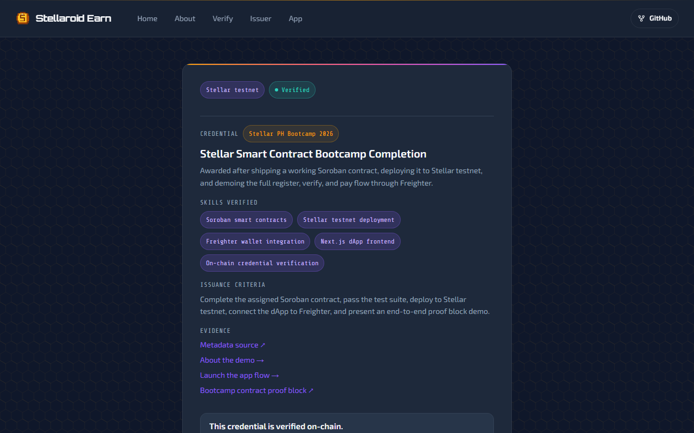
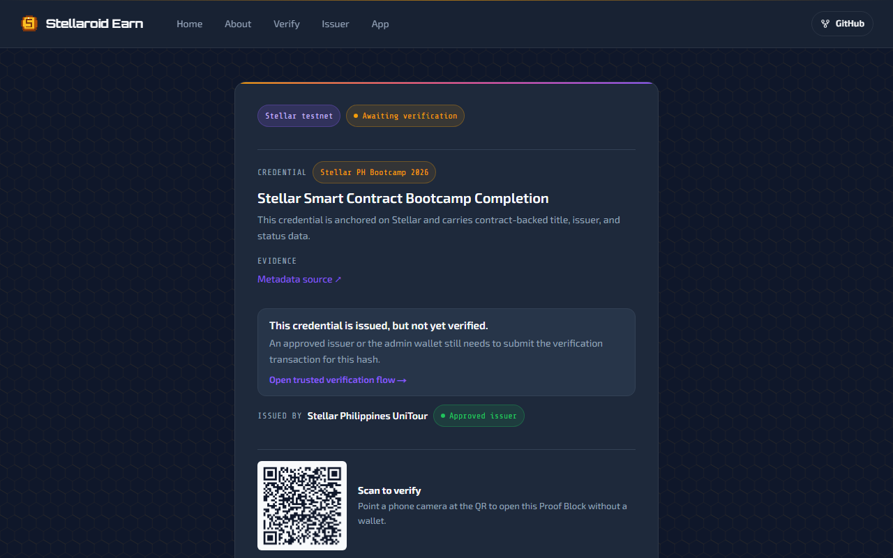

# Stellaroid Earn

On-chain credential registry and employer payment rail for bootcamp graduates, built on Stellar.

---

## Problem

A bootcamp graduate has no way to prove their skills to an employer without trusting a third party to vouch for them. Paper certificates and PDF badges are easy to fake and impossible to verify independently. Employers either skip verification or pay for a background check service. The graduate's achievement lives on someone else's server.

## Solution

Stellaroid Earn stores credential hashes on a Soroban smart contract. An approved issuer (bootcamp organizer) registers and verifies the certificate on-chain. Anyone — recruiter, employer, or peer — can verify the credential at a public URL with no login required. Employers can pay the graduate directly in XLM through the same contract, turning a credential into a payment rail.

---

## Demo Flow (2 minutes)

1. Connect Freighter wallet (testnet)
2. Issuer applies and gets approved by admin on-chain
3. Issuer registers a certificate hash for a graduate
4. Admin or issuer verifies the credential — status changes to **Verified**
5. Anyone scans the QR or visits `/proof/[hash]` — no wallet or login needed
6. Employer pays graduate in XLM directly through the contract

---

## Architecture

```
Browser (Next.js 15 + React 19)
  |-- Freighter Wallet API      (signing)
  |-- @stellar/stellar-sdk      (transaction building, RPC)
  |-- Soroban RPC               (on-chain reads and writes)

Stellar Testnet
  |-- Stellaroid Earn Contract  (credential registry + payment rail)
  |-- Native XLM SAC            (payment token, CDLZFC3S…)
```

No backend server. All credential state lives on-chain. Read-only proof lookups use a funded read address so visitors never need a wallet.

---

## Project Structure

```
Workshop-Stellaroid_Earn/
├── contract/
│   ├── src/
│   │   ├── lib.rs              # Soroban credential + payment contract (433 lines)
│   │   └── test.rs             # 5 contract tests
│   └── Cargo.toml
├── frontend/
│   ├── src/
│   │   ├── app/                # Next.js App Router pages
│   │   │   ├── app/            # Participant dashboard
│   │   │   ├── issuer/         # Issuer registration + management
│   │   │   └── proof/[hash]/   # Public shareable proof card
│   │   ├── components/         # UI components (proof card, wallet, badges)
│   │   ├── hooks/              # Freighter wallet state
│   │   └── lib/                # Contract client, RPC helpers, types
│   ├── public/                 # Illustrations, OG images
│   └── .env.example            # Environment variable template
├── demo/                       # Demo script, FAQ, press kit
├── docs/                       # Specs and implementation plans
└── README.md
```

---

## Stellar Features Used

| Feature | Usage |
|---|---|
| Soroban smart contracts | Credential registry — register, verify, revoke, suspend, expire |
| Issuer trust layer | On-chain issuer approval and suspension by admin |
| Native XLM | Direct employer-to-graduate payments via `reward_student` |
| Native XLM SAC | Token interface for XLM in contract payment calls |
| Freighter Wallet | Browser signing for all write transactions |
| Soroban RPC | Read-only credential lookups — no wallet needed for verification |
| `simulateTransaction` | Gas-free reads using a funded read address |

---

## Smart Contract

Deployed on Stellar testnet:

```
CBNSOFNXAOIFFKCOZLT7UZ5EEPB3ML2DP4YUGF24M4VBJCUWEHI2DX2Y
```

Explorer: https://stellar.expert/explorer/testnet/contract/CBNSOFNXAOIFFKCOZLT7UZ5EEPB3ML2DP4YUGF24M4VBJCUWEHI2DX2Y


### Contract Functions

| Function | Caller | Description |
|---|---|---|
| `init(admin, token)` | Deployer | Initialize contract with admin address and XLM token |
| `register_issuer(address, name, website, category)` | Anyone | Submit issuer application (Pending status) |
| `approve_issuer(admin, issuer)` | Admin | Approve an issuer to register credentials |
| `suspend_issuer(admin, issuer)` | Admin | Suspend a misbehaving issuer |
| `get_issuer(issuer)` | Anyone | Read issuer record and status |
| `register_certificate(issuer, owner, hash, title, cohort, metadata_uri, expires_at)` | Approved issuer | Register a credential hash for a graduate |
| `verify_certificate(issuer, cert_hash)` | Admin or approved issuer | Mark a credential Verified |
| `revoke_certificate(issuer, cert_hash)` | Admin or approved issuer | Permanently revoke a credential |
| `suspend_certificate(issuer, cert_hash)` | Admin or approved issuer | Temporarily suspend a credential |
| `reward_student(employer, cert_hash, amount)` | Employer | Pay graduate in XLM, linked to credential |
| `link_payment(payer, cert_hash, amount)` | Anyone | Record a payment reference on a credential |
| `get_certificate(cert_hash)` | Anyone | Read full credential record and status |

### Credential Status Lifecycle

```
Issued --> Verified  (issuer or admin calls verify_certificate)
       --> Revoked   (issuer or admin calls revoke_certificate)
       --> Suspended (issuer or admin calls suspend_certificate)
       --> Expired   (automatically after expires_at ledger sequence)
```




---

## Prerequisites

**Smart contract:**
- Rust (latest stable)
- Stellar CLI v26+
- `wasm32v1-none` WASM target
- Testnet account funded via Friendbot

**Frontend:**
- Node.js 18+
- Freighter browser extension set to Testnet
- Testnet XLM for gas

---

## Setup

### Smart Contract

```bash
# Test
cd contract && cargo test

# Build
stellar contract build

# Deploy to testnet
stellar keys generate my-key --network testnet --fund
stellar contract deploy \
  --wasm target/wasm32v1-none/release/stellaroid_earn.wasm \
  --source my-key \
  --network testnet
```

### Frontend

```bash
cd frontend
npm install
npm run dev
# open http://localhost:3000
```

**Environment variables** — copy `.env.example` to `.env.local` and fill in:

```env
NEXT_PUBLIC_STELLAR_RPC_URL=https://soroban-testnet.stellar.org
NEXT_PUBLIC_STELLAR_NETWORK=TESTNET
NEXT_PUBLIC_STELLAR_NETWORK_PASSPHRASE=Test SDF Network ; September 2015
NEXT_PUBLIC_SOROBAN_CONTRACT_ID=<your deployed contract ID>
NEXT_PUBLIC_STELLAR_ADMIN_ADDRESS=<your admin wallet G... address>
NEXT_PUBLIC_STELLAR_READ_ADDRESS=<any funded testnet address for read-only calls>
NEXT_PUBLIC_SOROBAN_ASSET_ADDRESS=CDLZFC3SYJYDZT7K67VZ75HPJVIEUVNIXF47ZG2FB2RMQQVU2HHGCYSC
NEXT_PUBLIC_SOROBAN_ASSET_CODE=XLM
NEXT_PUBLIC_SOROBAN_ASSET_DECIMALS=7
NEXT_PUBLIC_STELLAR_EXPLORER_URL=https://stellar.expert/explorer/testnet
```

---

## Sample CLI Invocations

```bash
# Initialize contract (run once after deploy)
stellar contract invoke \
  --id CBNSOFNXAOIFFKCOZLT7UZ5EEPB3ML2DP4YUGF24M4VBJCUWEHI2DX2Y \
  --source my-key \
  --network testnet \
  -- init \
  --admin <ADMIN_ADDRESS> \
  --token CDLZFC3SYJYDZT7K67VZ75HPJVIEUVNIXF47ZG2FB2RMQQVU2HHGCYSC

# Approve an issuer
stellar contract invoke \
  --id CBNSOFNXAOIFFKCOZLT7UZ5EEPB3ML2DP4YUGF24M4VBJCUWEHI2DX2Y \
  --source my-key \
  --network testnet \
  -- approve_issuer \
  --admin <ADMIN_ADDRESS> \
  --issuer <ISSUER_ADDRESS>

# Look up a certificate
stellar contract invoke \
  --id CBNSOFNXAOIFFKCOZLT7UZ5EEPB3ML2DP4YUGF24M4VBJCUWEHI2DX2Y \
  --network testnet \
  -- get_certificate \
  --cert_hash <32_BYTE_HEX_HASH>
```

---

## Target Users

**Bootcamp graduates** — proof of skill that lives on-chain, shareable as a URL or QR code, verifiable by anyone without asking the bootcamp organizer.

**Employers and HR** — one-click credential check with no login, no API key, no background check service. Green means verified on-chain. Red means revoked. No ambiguity.

**Bootcamp organizers (issuers)** — register and verify credentials directly from the issuer dashboard, no backend needed. Issuer approval is also on-chain so verifiers can trust the source.

---

## Why Stellar

Sub-cent fees and 5-second finality make the credential write cheap enough that issuers won't skip it. Soroban gives us custom contract logic — issuer approval, expiry, revocation — without a backend. Public verifiability via `simulateTransaction` means anyone can check a proof with just a hash and a public RPC endpoint, no wallet required. The same contract that stores the credential also handles employer payments, closing the loop from proof to payout on one chain.

---

## Live Demo

| | |
|---|---|
| **Live demo** | https://stellaroid-earn-demo.vercel.app/ |
| **Contract ID (current)** | [`CBNSOFNXAOIFFKCOZLT7UZ5EEPB3ML2DP4YUGF24M4VBJCUWEHI2DX2Y`](https://stellar.expert/explorer/testnet/contract/CBNSOFNXAOIFFKCOZLT7UZ5EEPB3ML2DP4YUGF24M4VBJCUWEHI2DX2Y) — trust-layer ABI, proof block redesign |
| **Contract ID (stable v1)** | [`CDWCARXLJUJ5ISC3GPXRLR5HC6QPLMGULCVRIACYKQM4U5AG7TFWXHVZ`](https://stellar.expert/explorer/testnet/contract/CDWCARXLJUJ5ISC3GPXRLR5HC6QPLMGULCVRIACYKQM4U5AG7TFWXHVZ) — original deploy, stable branch |
| **Proof txs (v1)** | [init](https://stellar.expert/explorer/testnet/tx/c7de2d61cfd1f51cfb255379775dd928604d264d6b5bb3775dc75cdd7c4b5721) · [register](https://stellar.expert/explorer/testnet/tx/1e8078e36333023c46f11a0bd990f97b62bd13ae086597de6a3db8e66d4b3a22) · [verify](https://stellar.expert/explorer/testnet/tx/2215e08ecc935b6f31d5c335c3aaea3e3742f07ef993d8ca947d1711ad5199d9) · [payment](https://stellar.expert/explorer/testnet/tx/5bed652b3725a6826cd4a99e8c750cdd2dc4625f7e3a4a82661680ada50cb435) |


---

## Resources

| Resource | Link |
|---|---|
| Rise In Programs | [risein.com/programs](https://www.risein.com/programs) |
| Stellar Docs | [developers.stellar.org](https://developers.stellar.org) |
| Soroban SDK | [docs.rs/soroban-sdk](https://docs.rs/soroban-sdk) |
| Stellar CLI | [developers.stellar.org/docs/tools/stellar-cli](https://developers.stellar.org/docs/tools/stellar-cli) |
| Freighter Wallet | [freighter.app](https://freighter.app) |
| Stellar Expert (Testnet) | [stellar.expert/explorer/testnet](https://stellar.expert/explorer/testnet) |
| Bootcamp Repo (upstream) | https://github.com/armlynobinguar/Stellar-Bootcamp-2026 |
